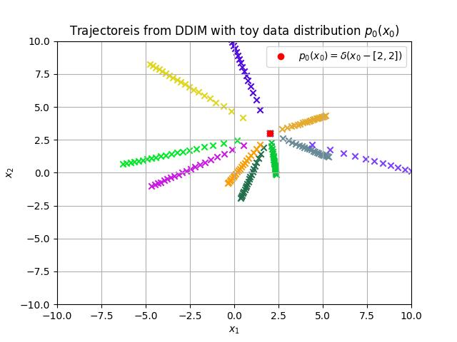

# Introduction

In this repository, I am attempting to understand diffusion models from scratch using [Step-by-Step Diffusion: An Elementary Tutorial](https://arxiv.org/abs/2406.08929).

# Experiments

The `experiments` folder contains subfolders corresponding to different experiements. Each experiment explores a small concept, performs a sanity check or creates a proof-of-concept setup to implement an idea (there are only four experiments right now but more will be added as I learn and explore diffusion models further).

There is a description at the top of a main script in each experiment that details what the experiment aims to do (I plan to add a `readme` file for each experiment later). There is also a `figures` subfolder in each experiment containing resulting figures that should be produced by running the experiment. These figures should give some idea on what the experiment is about. To run an experiment (check [setup](#installation) first):

```
cd experiments/<experiment-name>

python <name-of-main-script>.py
```

Below is a short description of each experiment with illustrative figures.

## Experiment-0

For a known 1D-Gaussian data distribution (for which $E[x_{t-\Delta t}|x_{t}]$ can be manually obtained), this experiment demonstrates that starting from a base distribution, samples obtained from reverse sampling of DDPM and DDIM (using above $E[x_{t-\Delta t}|x_{t}]$) (Alg. (1) and (2) in the tutorial) produces a histogram that resembles the original data distribution. 


## Experiment-1

For a degenerate data distribtion in 2D i.e., $p_o(x_{o}) = \delta(x_{o} - [2, 3])$ (again $E[x_{t-\Delta t}|x_{t}]$ can be obtained manually), this experiment plots the trajectories of DDIM samples during reverse sampling. The trajectories converge to the single data point. 



## Experiment-2

Same as `experiment-1` but $p_{o}(x_{o}) = 0.5 \delta(x_{o} - [2, 2]) + 0.5 \delta(x_{0} - [-2, 2])$. 


## Experiment-3

For synthetic Swiss roll dataset, this experiment trains a fully connected NN with ReLU activations to learn $E[x_{0}| x_{t}]$ from data. Then $E[x_{t-\Delta t}| x_{t}]$ is obtained via its relationship to $E[x_{0}| x_{t}]$ (eq. (24) in the tutorial) which is then used in the reverse sampling of DDPM and DDIM. 


# Installation

```
git clone https://github.com/mosama182/diffusion_models.git
```
Create new conda environment and install requirements.

```
pip install requirements.txt
```

