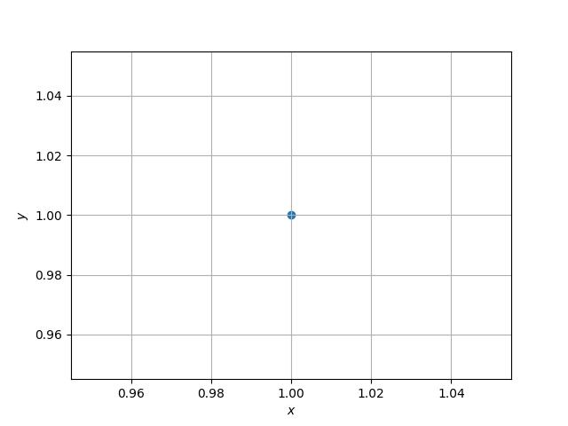
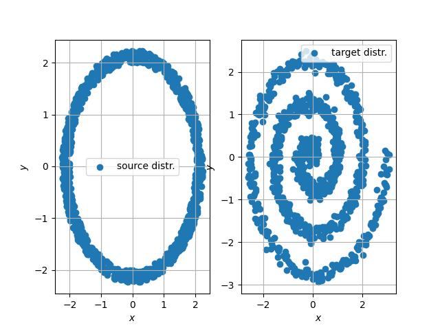

# Introduction

This repository contains some toy experiments to illustrate/reconstruct some of the concepts/examples in the following tutorial on diffsuion modeling [Step-by-Step Diffusion: An Elementary Tutorial](https://arxiv.org/abs/2406.08929). It can be used for learning and pedagogical purposes.  

# Experiments

The `experiments` folder contains subfolders corresponding to different experiements. Each experiment explores a small concept, performs a sanity check or creates a proof-of-concept setup to implement an idea.

There is a description at the top of a main script in each experiment that details what the experiment aims to do. There is also a `figures` subfolder in each experiment containing resulting figures that should be produced by running the experiment. These figures should give some idea on what the experiment is about. To run an experiment (check [setup](#installation) first):

```
cd experiments/<experiment-name>

python <name-of-main-script>.py
```

Below is a short description of each experiment with illustrative figures.

## Experiment-0

For a known 1D-Gaussian data distribution $p_{o}(x_{o}) = \mathcal{N}(\mu_{0}, \sigma_{o}^{2})$, this experiment demonstrates that starting from samples from a base distribution $p_{1}(x_{1}) = \mathcal{N}(0, \sigma_{q}^{2})$, and applying reverse sampling of DDPM and DDIM (Alg. (1) and (2) respectively in the tutorial) produces a histogram that resembles the original data distribution $p_{o}(x_{o})$. The conditional expectation needed for DDPM and DDIM can be obtained manually and is given by $$E[x_{t-\Delta t}|x_{t}] = \frac{1}{\sigma_{o}^{2} + \sigma_{q}^{2}t} \Big((\sigma_{o}^{2} + \sigma_{q}^{2}(t - \Delta t)) x_{t} + \sigma_{q}^{2}\Delta t \mu_{o} \Big).$$ 

<div style="text-align: center;">
    
</div>

## Experiment-1

For a degenerate data distribtion in 2D i.e., $p_o(\mathbf{x_{o}}) = \delta(\mathbf{x_{o}} - \mathbf{a})$, this experiment plots the trajectories of DDIM samples (Alg. (2) in the tutorial) during reverse sampling when starting from samples from a base distribution  $p_{1}(x_{1}) = \mathcal{N}(\mathbf{0}, \sigma_{q}^{2}\mathbf{I})$. The trajectories move towards the single data point. Here $$E[x_{t-\Delta t}|x_{t}] = \frac{(t - \Delta t)}{t} \mathbf{x_{t}} + \frac{\Delta t}{t} \mathbf{a}.$$  

<div style="text-align: center;">
    
</div>

## Experiment-2

Same as `experiment-1` but with data distribution being $p_{o}(\mathbf{x_{o}}) = 0.5 \delta(\mathbf{x_{o}} - \mathbf{a}) + 0.5 \delta(\mathbf{x_{0}} - \mathbf{b})$. The trajectories move towards one of the two data points. 

Here,

$$E[x_{t-\Delta t} | x_{t}] = p(x_{o} = a | x_{t}) * E[x_{t-\Delta t} | x_{t}, x_{o} = a] + p(x_{o} = b | x_{t}) * E[x_{t-\Delta t} | x_{t}, x_{o} = b],$$

where the $E[x_{t-\Delta t} | x_{t}, x_{o} = a]$ is the same as in `experiment-1` and 

$$p(x_{o} = a | x_{t}) = \frac{p_{o}(x_{o} = a) p(x_{t} | x_{o} = a)}{p_{t}(x_{t})}$$

by Baye's rule. The expressions for $p(x_{t} | x_{o} = a)$ and $p_{t}(x_{t})$ can be obtained easily from the forward diffusion process.

<div style="text-align: center;">
    
</div>

## Experiment-3

Here the data distribution $p_{o}(x_{o})$ is synthetic Swiss roll data (see Figure below). The base distribution is $p_{1}(x_{1}) = \mathcal{N}(\mathbf{0}, \sigma_{q}^{2}\mathbf{I})$. We want to estimate $E[x_{t- \Delta t}| x_{t}]$ from data. A fully connected NN with ReLU activations is trained to first learn $E[x_{0}| x_{t}]$. Then $E[x_{t-\Delta t}| x_{t}]$ is obtained via its relationship to $E[x_{0}| x_{t}]$ (eq. (24) in the tutorial) which is then used in the reverse sampling of DDPM and DDIM. 

<div style="text-align: center;">
    
    
</div>

## Experiment-4

This experiment is about flow matching where we learn a flow $v_{t}(x_{t})$ to transform samples from a base distribution $x_{1} \sim p_{1}(x_{1})$ to samples from data distribution $x_{o} \sim p_{o}(x_{o})$. Given $v_{t}(x_{t})$, the samples are transformed according to

$$x_{t - \Delta t} = x_{t} + v_{t}(x_{t}) \Delta t$$

$\text{for}~t = 1, 1 - \Delta t, \ldots, \Delta t.$

To learn the flow, for every pair $(x_{o}, x_{1})$ we define a pointwise flow $v_{t}^{[x_{o}, x_{1}]}(x_{t})$ which moves point $x_{1}$ at $t=1$ to $x_{o}$ at $t=0$ and satisfies $\frac{\partial x_{t}}{\partial t} = - v_{t}^{[x_{o}, x_{1}]}(x_{t})$. One example is linear flow i.e.,

$$v_{t}^{[x_{o}, x_{1}]}(x_{t}) = x_{0} - x_{1} \implies x_{t} = t x_{1} + (1 - t) x_{0}.$$

Given the pointwise flow, the marginal flow is

$$v_{t}(x_{t}) = E_{x_{o}, x_{1} | x_{t}} [v_{t}^{[x_{o}, x_{1}]}(x_{t})| x_{t} ],$$

which can be learned by solving

$$\argmin_{\theta} E_{x_{o}, x_{1}, x_{t}}\Big[\big(f_{\theta}(x_{t}, t) - v_{t}^{[x_{o}, x_{1}]}(x_{t})\big)^{2}\Big].$$

That is minimize the mean square error to the pointwise flow over samples $x_{o}, x_{1}, x_{t}$.

Here the base distribution $p_{1}(x_{1}): \text{Annular}$ and the data distribution $p_{1}(x_{1}): \text{Spiral}$ (see figure below). `Pseudocode 4` in the tutorial with linear pointwise flows is used to learn the flow $v_{t}(x_{t})$. A simple fully connected NN is used. Then `Pseudocode 5` in the tutorial is used to sample from the target distribution. The animation below shows the flow of data points from annular distribution
to spiral using the learned flow. 

<div style="text-align: center;">
  
  
</div>

# Installation
Create `conda` environment with `python==3.9.19`:
```
conda create -n <env-name> python==3.9.19
conda activate <env-name>
```

Make sure `git lfs` is installed:
```
brew install git-lfs (for macOS)
pip install git-lfs (for Linux)
git lfs install
```

Clone repository:
```
git clone https://github.com/mosama182/diffusion_models.git
```

Install requirements:

```
pip install -r requirements.txt
```

